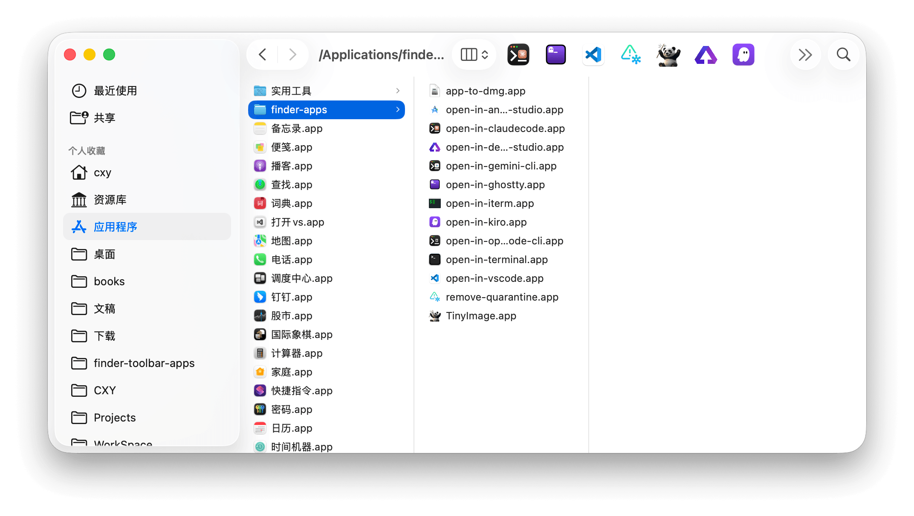

# macOS Finder 工具栏应用集

macOS 一键快速操作工具包。精选实用应用，放入 Finder 工具栏，快速处理文件。     

[English README](./README_en.md)

## 应用集

- **open-in-** 系列（20+ app）快速在指定应用中打开文件/目录（VS Code、Terminal、PyCharm 等）
- **app-to-dmg**  将 .app 应用/目录打包为 .dmg 镜像文件
- **remove_quarantine**  移除应用隔离属性，解决未签名应用"无法打开"问题
- **[TinyImage](https://github.com/iHongRen/TinyImage)**  选中图片或图片目录，直接在 Finder 中压缩图片



## 安装

1. 下载并打开 [apps.dmg](https://github.com/iHongRen/finder-toolbar-apps/releases)，拖拽所需 app 到 Applications/ 


2. 按住 `⌘ Command` 键，用鼠标将 `xxx.app` 拖到 Finder 工具栏  


  

3. 打开终端，执行以下命令去除隔离属性，将`xxx` 替换为安装的 app 名称。
  
   或者使用上面的 **remove_quarantine.app**，支持批量去除隔离属性。
   
   ```bash
   xattr -d com.apple.quarantine /Applications/xxx.app
   ```


## 使用

在 Finder 中选择需要处理的文件或者文件夹，然后点击工具栏上的 app 就能快速处理。


**open-in-claudecode**、**open-in-codex-cli**、**open-in-opencode-cli**、**open-in-gemini-cli**，等 app 会自动检测当前系统设置的默认终端，并使用终端打开并执行对应的 claude/codex/opencode/gemini 命令。

当前支持的默认终端为 `Ghostty`、`iTerm2`、`WezTerm`、`Alacritty`、`kitty`、系统 `Terminal`，不在范围内，则使用 Terminal 打开。

自定义指定终端，在用户目录新建配置文件 `~/.openin/config`（YAML 格式）

```yaml
# file: /Users/xxx/.openin/config

# values: Ghostty、iTerm2、WezTerm、Alacritty、kitty、Terminal
OPEN_IN_CLAUDECODE_TERM: "iTerm2"
OPEN_IN_CODEX_CLI_TERM: "WezTerm"
OPEN_IN_OPENCODE_CLI_TERM: "Alacritty"
OPEN_IN_GEMINI_CLI_TERM: "kitty"
```


## 常见问题
**Q: 忘记点同意权限怎么办？**

A: 打开系统设置 → 隐私与安全性 → 自动化 → 找到 `open-in-xxx.app`，勾选「访达」权限。