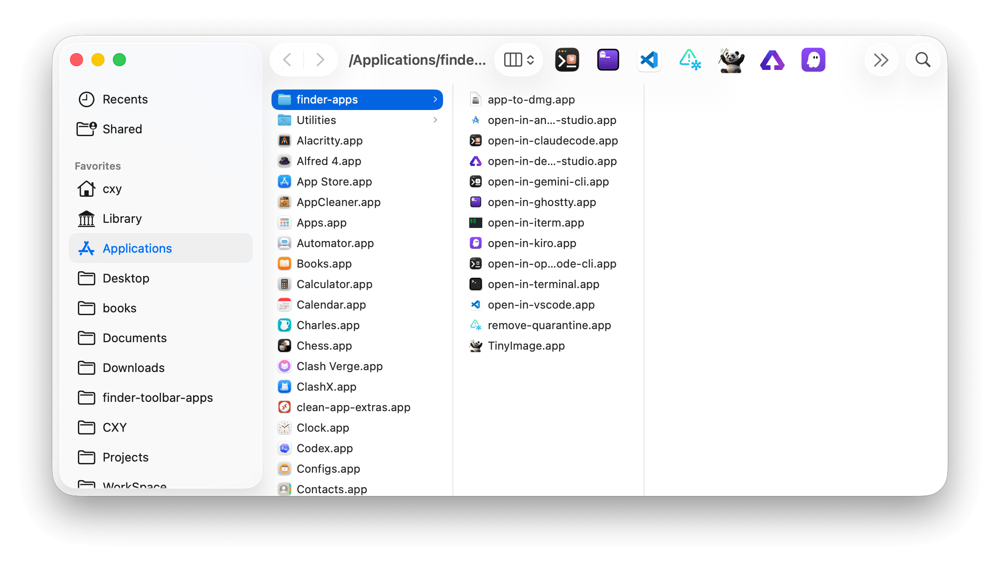
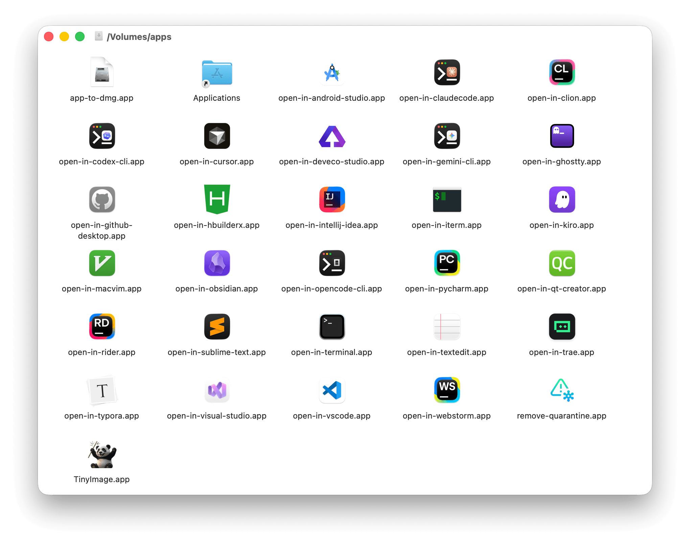
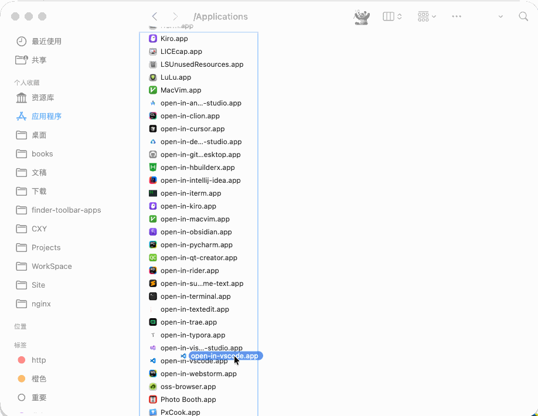

# macOS Finder Toolbar App Collection

macOS one-click quick action toolkit. A curated set of handy apps you can place in the Finder toolbar to quickly operate on files.

[中文 README](./README.md)

## Applications

- **open-in-** series (20+ apps): quickly open files or folders in a specific app (VS Code, Terminal, PyCharm, etc.)

- **app-to-dmg**: package a .app bundle or directory into a .dmg disk image

- **remove_quarantine**: remove the app quarantine attribute to fix "cannot open" issues

- **[TinyImage](https://github.com/iHongRen/TinyImage)**: lossless image compression to reduce file size



## Installation

1. Download and open [apps.dmg](https://github.com/iHongRen/finder-toolbar-apps/releases), then drag the desired app(s) to the `Applications/` folder



2. Hold the `⌘ Command` key and drag the `xxx.app` item to the Finder toolbar




3. Open Terminal and run the following command to remove the quarantine attribute (replace `xxx` with the installed app name):
   
   Alternatively, use the **remove_quarantine.app** above to batch remove quarantine attributes.
   
   ```bash
   xattr -d com.apple.quarantine /Applications/xxx.app
   ```


## Usage

Select the file or folder in Finder that you want to act on, then click the app in the toolbar to perform the quick action.

Apps like **open-in-claudecode**, **open-in-codex-cli**, **open-in-opencode-cli**, **open-in-gemini-cli** will automatically detect the system's default terminal and use it to open and execute the corresponding claude/codex/opencode/gemini command.

Currently supported terminals: `Ghostty`, `iTerm2`, `WezTerm`, `Alacritty`, `kitty`, and the system `Terminal`. If not in the supported list, it will fall back to using Terminal.

To customize the terminal, create a config file `~/.openin/config` in YAML format in your home directory:

```yaml
# file: /Users/xxx/.openin/config

# values: Ghostty、iTerm2、WezTerm、Alacritty、kitty、Terminal
OPEN_IN_CLAUDECODE_TERM: "iTerm2"
OPEN_IN_CODEX_CLI_TERM: "WezTerm"
OPEN_IN_OPENCODE_CLI_TERM: "Alacritty"
OPEN_IN_GEMINI_CLI_TERM: "kitty"
```


## FAQ

**Q: What if I accidentally denied the permission prompt?**

A: Go to System Settings → Privacy & Security → Automation → Find open-in-xxx.app and check "Finder" permission.